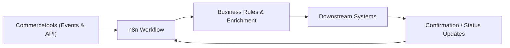

# n8n + Commercetools Business Flow Documentation

This document explains, in business terms, how the n8n workflow connects with Commercetools, how events are captured, and how responses and actions are handled. It is intended for stakeholders, product owners, and operations teams.

---

## 1) Business Purpose

The integration enables near real-time synchronization and automation between Commercetools (commerce platform) and downstream business processes (ERP, CRM, data warehouse, email/notification systems, fulfillment, and analytics). It reduces manual work, improves data quality, and accelerates operational response.

---

## 2) Key Business Actors

- **Commercetools**: System of record for product, category, customer, cart, and order data.
- **n8n**: Automation and orchestration platform that routes events, applies business logic, and triggers actions.
- **Downstream Systems**: External tools that consume or update data (ERP, CRM, PIM, BI, email/marketing, logistics).
- **Operations Team**: Monitors workflows, handles exceptions, and ensures business continuity.

---

## 3) High-Level Flow (Business View)

---

## 4) How the Integration Works (End-to-End)

### A. Event Capture (Trigger)
Commercetools generates events when key business objects change, such as:
products, categories, customers, carts, and orders.  
These events notify n8n instantly through a secure webhook channel.

### B. Optional Reliability Buffer (Recommended for Scale)
For higher reliability and larger volumes, events can pass through an AWS buffer (SQS + Lambda).  
This prevents data loss, smooths traffic spikes, and ensures delivery even during temporary outages.

### C. Business Logic & Validation
n8n applies business rules, for example:
- Validate mandatory data before passing it on
- Enrich payloads with additional context (store, channel, tax, shipping)
- Route based on product type, customer segment, or order status

### D. Actions & Responses
n8n performs the required business actions, such as:
Sending data to ERP/CRM, updating fulfillment systems, or notifying teams.  
If needed, n8n can also update Commercetools (e.g., order status changes, customer updates).

### E. Monitoring & Exception Handling
n8n tracks workflow execution. Failures are logged and can trigger alerts for operations teams.  
Retries and corrective actions can be configured to maintain business continuity.

---

## 5) What Business Objects Are Covered

- **Products**: create, update, publish, pricing updates, images, variants
- **Categories**: create, update, organize catalog structure
- **Customers**: create, profile updates, address changes
- **Carts**: cart creation and updates
- **Orders**: order creation, status changes, payments, shipments

---

## 6) Typical Business Use Cases

- **Product Launch Automation**  
  When a product is published in Commercetools, n8n automatically distributes it to the PIM and marketing tools.

- **Customer Data Synchronization**  
  Customer profile updates are routed to CRM and data warehouse in real time.

- **Order Fulfillment**  
  New orders are pushed to fulfillment systems; shipment updates can flow back into Commercetools.

- **Pricing & Promotion Control**  
  Price or discount changes trigger updates in analytics dashboards and downstream sales channels.

---

## 7) Business Value & Outcomes

- **Speed**: Events are processed near real-time
- **Accuracy**: Automated data exchange reduces manual error
- **Reliability**: Optional buffering improves delivery guarantees
- **Scalability**: Supports high-volume catalogs and order traffic
- **Transparency**: Centralized monitoring and auditability

---

## 8) Governance & Security (Business-Friendly View)

- Secure OAuth2 authentication to Commercetools
- Optional AWS-managed infrastructure for reliability
- Role-based credentials and least-privilege access
- Audit trail via workflow execution logs

---

## 9) Service Readiness & Operations

- **Monitoring**: Workflow execution logs and alerts  
- **Retries**: Automatic retry logic for transient failures  
- **Ownership**: Operations team monitors daily health  
- **Maintenance**: Update credentials and scopes as business needs evolve  

---

## 10) Summary

This integration provides a robust, business-grade event flow between Commercetools and enterprise systems.  
n8n acts as the orchestration hub to capture, validate, and distribute commerce events, ensuring faster operations, fewer errors, and better alignment across business functions.

